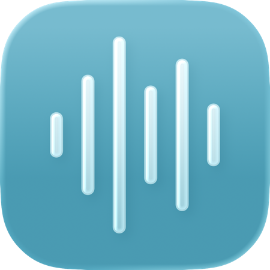

# Jello 🎶
### A Lock Screen audio visualizer for iOS 16.0+/iPadOS 17.0+.

Jello is a lightweight alternative to Mitsuha that doesn't rely on `mediaserverd` injection.

---

  <picture>
    <source media="(prefers-color-scheme: dark)" srcset="JelloIconDark.png">
    
  </picture>

---

## Compatibility & Installation

Supports rootless and semi-jailbreaks on **iOS 16.0+** and **iPadOS 17.0+**. (Note: iPadOS 16 is unsupported as it lacks the modern lock screen media player).

Download the latest version from **[Releases](https://github.com/shalamand3r/Jello/releases)** or **[Add my Sileo Repo](https://shalamand3r.github.io)**.

## How it Works

Instead of analyzing raw audio, Jello repurposes the waveform data iOS already generates for the Lock Screen media player:
- `JelloWaveform` hooks `MRUWaveformController` to read iOS's amplitude data, quantizes the first 6 values, and broadcasts them.
- `JelloLockscreen` hooks `CSFixedFooterViewController` to map those 6 values to your active visualizer.

## Limitations

Because Jello uses the pre-calculated iOS waveform rather than raw audio data, it is limited to 6 frequency points. It provides a fun visual but won't be as accurate as raw audio visualizers. Hopefully this means that Jello will have a lower impact on battery life, though.

- The depth effect on wallpapers pushes the visualizer behind a layer.
- Expanding album artwork overlays visualizer (you can put visualizer on now playing view as a fix for now).
- Now Playing view causes the visualizer to appear on all live activities.

---
## Credits
- The creators of the original Mitsuha tweak for the inspiration.
---

  

